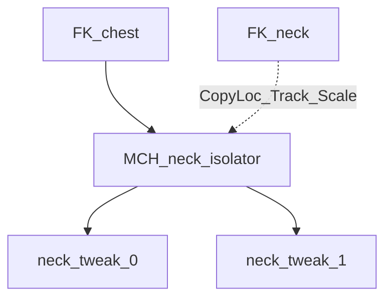

# Torso Neck + Master Controls

## Status

Core torso is already in place: [torso_fk.py](rigtools/tool/torso_fk.py), [torso_assembly.py](rigtools/assemblies/torso_assembly.py) (incl. neck/head RotationIsolation), [torso_templates.py](rigtools/assemblies/torso_templates.py), [torso_setup.py](rigtools/panels/fk/torso_setup.py).

Docs from the old plan (docs/torso.md) stay out of scope for this pass.

## 1. Head to neck rotation follow

In TorsoFK pose mode:

- On each neck ORG/twist bone that already has the tweak track constraint, add Copy Rotation from the head control, then move it to constraint slot 0 (same pattern as TwistBones.pose_mode).
- Influence via twist_influence(falloff, index, count, reverse=False) with head as index 0, neck bones as 1..n, count = n + 1. Hardcode falloff ROOT (1 bone ~0.29; 2 bones ~0.42 / 0.18).
- No new redo/template param. Works with or without twist subdivisions.

## 2. Chest to neck twist isolator (auto fix)

Owned by TorsoFK (file length OK; extract helpers later only if it hurts).

Pass add_neck_rotation_isolation from create_torso_assembly into TorsoFK so it can decide without waiting for isolation to run.

Create isolator in edit mode after tweaks when:

- add_neck_rotation_isolation is true, and
- neck tweak span has more than one bone (twist ORGs and/or neck_bone_count > 1)

Wiring:

- MCH authored on first neck tweak; parent = FK-chest; children = first and second neck tweaks
- Pose: Copy Location + Damped Track (tail) + Copy Scale from FK-neck

Skip entirely if isolation is off. Do not parameterize.

## 3. Neck / head as master controls

In TorsoFK FK creation + widgets/colors:

- Neck controls: name via new prefs control_template default `{name}` (like IK); collection = control collection (not FK); color = control_bone_color
- Head control: name = settings.head_bone_name; same collection/color
- Spine/chest FKs stay on fk_template / FK collection / fk_bone_color
- Keep neck/head names in fk_bone_names so assembly isolation indexing still works

Add control_template next to the other name templates in [preferences.py](rigtools/preferences.py).

## 4. Small template cleanup

In [torso_templates.py](rigtools/assemblies/torso_templates.py), drop neck_twist_bone_count / chest_twist_bone_count from the Torso template redo_fields (keep hardcoded defaults on options). Leave them in REDO_PROPERTIES for Advanced.

## Out of scope

- docs/torso.md / mkdocs linking
- Generalizing isolator into TwistBones
- Exposing neck falloff or isolator toggles in the redo panel
