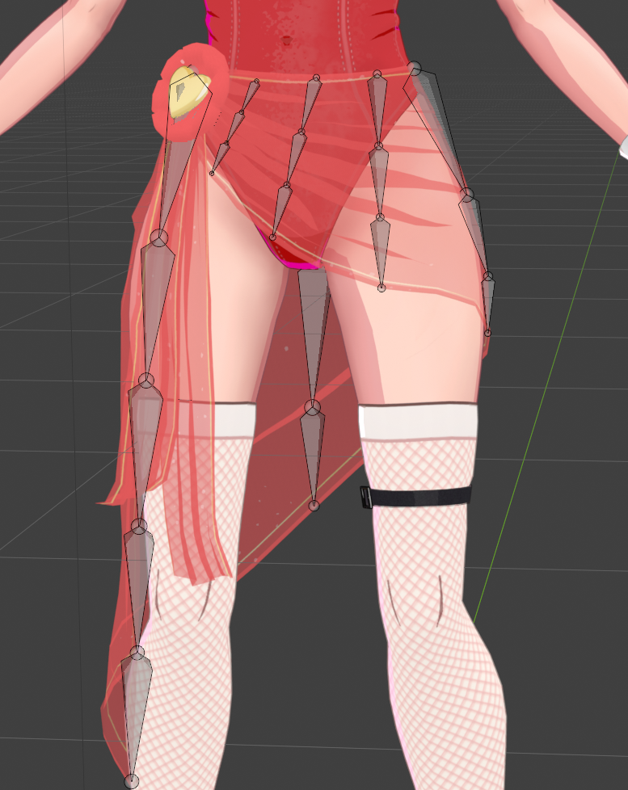
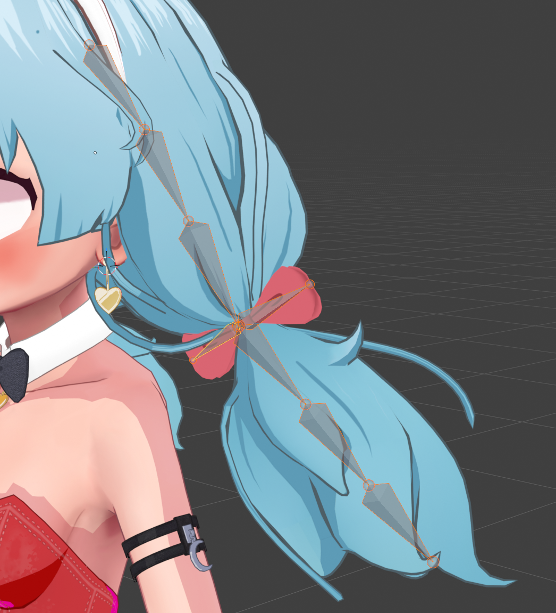
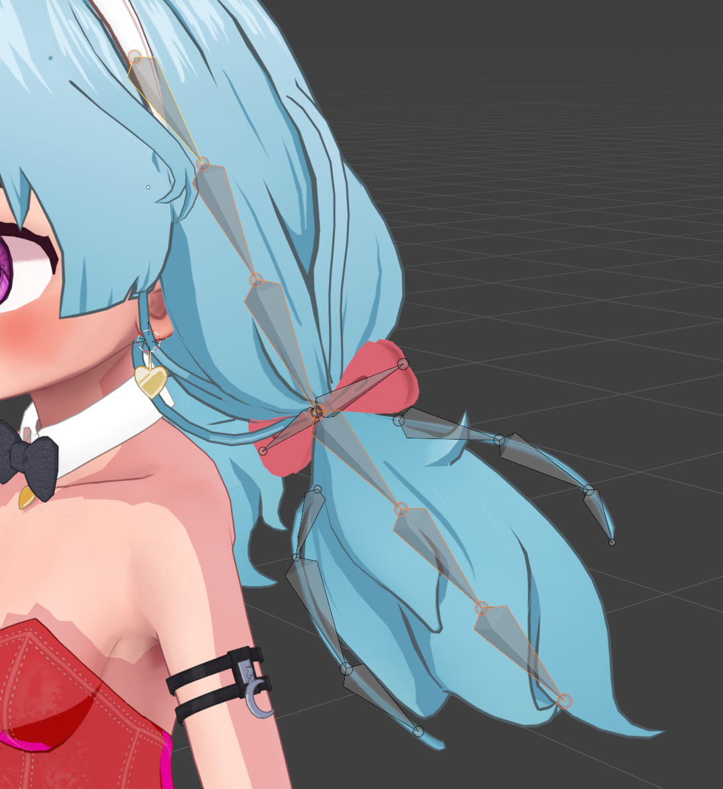
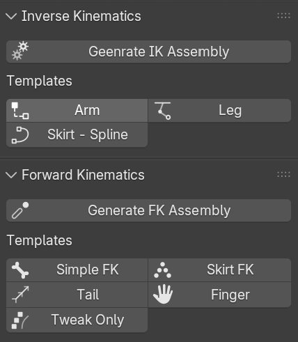
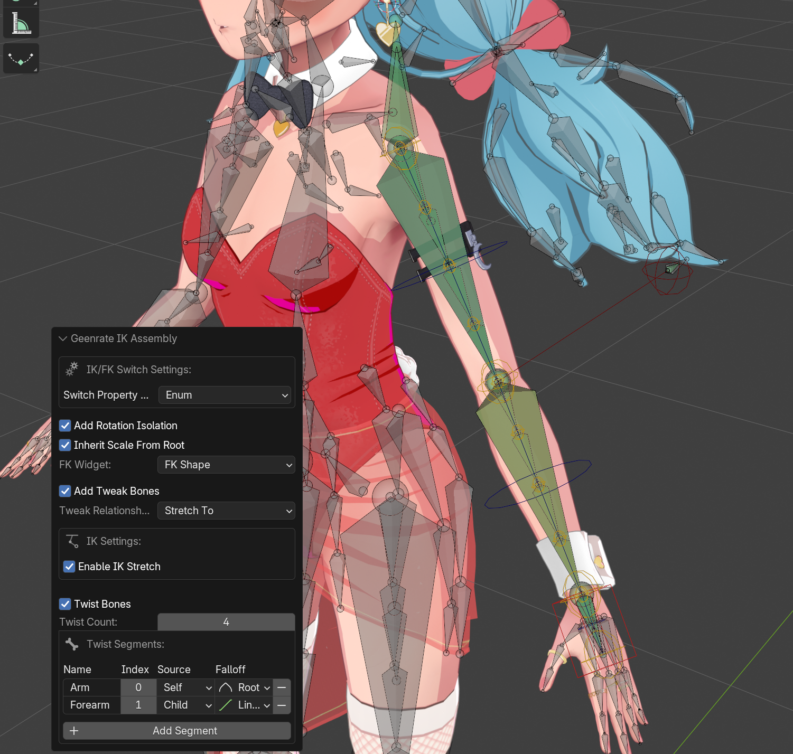
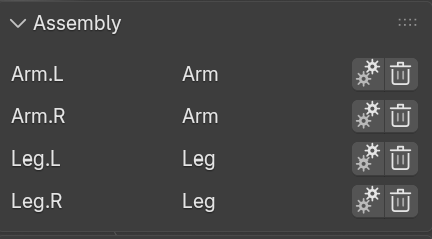

# Assemblies

One of the core operations with RigTools is the creation of "Assemblies".
For many purposes, an assembly is often analogous with a limb, like an arm or a leg.
You can create full arm and leg assemblies really quickly and easily.
Assemblies aren't restricted to just limbs, though, and you can potentially stack multiple assemblies 
on a single limb.

!!! tip "Start here"
    Assemblies are the main unit of rig building in Rig Tools.
    Read this page before the individual tool pages.

## Concepts

### Selection

!!! info "Requires"
    Armature selected · Edit or Pose mode · linear bone chain(s)

All assemblies start with a selection.  That selection needs to be one or more linear chains of bones.
When starting, it may be easier to think of it as a single chain of bones, but all assemblies
allow you to select multiple chains and it will one assembly per chain.
For some assemblies, it might not make a lot of sense to do that, but for others it will.

!!! note "Important"
    A chain is a sequence of bones linked by parenting: each bone (except the first) is a child of the previous one. Order runs from the root of the sequence toward the tip.
    A linear chain is a chain with no branching **within the selection**. At every step of the chain there is at most one child.

<figure markdown="span">
  { width="480" }
  <figcaption>Example of several simple linear chains for a skirt.</figcaption>
</figure>
    
Bones in a chain do not need to be connected.  RigTools only cares about parenting, which establishes bone order.  
If you have a chain that branches, such a hair with off-shoots, you can use the selection to tell RigTools
which bones make up a chain.

<figure markdown="span">
    { width="480" }
    <figcaption>Invalid chain - The third bone has three children.</figcaption>
</figure>

<figure markdown="span">
    { width="480" }
    <figcaption>Valid chain - several of these bones have more than one child, but they aren't part of the selection</figcaption>
</figure>

In this hair example, the main chain for the hair can be used to create an assembly.
The bones for the bow and the flyaways can be used to make another assembly, or be rigged manually.

The tools *[Select Hierarchy](docs/selection.md#select_hierarchy)* and *[Select Connected](docs/selection.md#select_connected)* can be used to help select chains.  They are particularly useful for selecting multiple chains.
The "Select Connected" tool can be useful for selecting just the connected parts of a branching chain.

### Reversable

All assemblies are reversable -- to a point.

When you create a new assembly, RigTools will save all the data about that assembly, including how to reverse it.
Assemblies can be deleted or reconfigured after they are created.

!!! warning "Important Caveat"
    You cannot delete or reconfigure an assembly if another assembly depends on it.
    RigTools checks automatically for dependancies and prevents this from happening.
    Deleting or reconfiguring will also delete any manual changes made
    and any manually dependancies you create will be orphaned.

Assembly dependancies usually requires that another assembly reference the control bones of another assembly, 
so it shouldn't happen in most normal circumstances.

Note that reconfiguring is just deleting and recreating.  It's not doing anything special to preserve existing bones.

With these important caveats, this is still a really powerful tool.  
It's probably best to think of it in the context of added flexibility within a short window of time.
You can try out an assembly and not have to worry about setting all the way back through a long undo buffer.
There also may be some times where it's still safe to reconfigure an assembly much later.
And sometimes, you might even know you're going to lose something and it's still the best solution.
By keeping track of all the assemblies and allowing you to delete them, RigTools maintains that flexibility.

## Creating Assemblies

After you've selected the correct bone chain, you can create a new assembly by click on one of the templates
in RigTools n-panel.
Currently, there are two sections of the n-panel that include templates: 
"Inverse Kinematics" and "Forward Kinematics".
Both of these panels include templates for creating assemblies.  The tools used behind the scenes are
slightly different, and the Inverse Kinematics are generally more complex and include FK/IK switching.
Forward kinematics are generally simpler chains that don't include IK constraints.

*This list will almost certainly be expanded in the future*

There are two larger buttons "Generate IK Assembly" and "Generate FK Assembly".
These are the core assembly generation tools, and they honestly shouldn't be used that often.
(They may be hidden in the future).
They offer a ton of flexibility -- almost too much -- but have a lot of settings that may be confusing, 
especially initially.
Instead, I recommend using one of the templates that most closely resembles what you're working on.
Where the generate tools open a dialog with tons of settings, the templates are one-click tools
that generate the assembly immediately using a sensible set of defaults,
while still offering a redo panel with a trimmed-down set of settings that are focused 
on the specific assembly type.

*Redo panel after creating an Arm IK Assembly (specific settings subject to change)*

## Assembly Panel

After you create an assembly, it will show up in the Assembly Panel.
The Assembly Panel will show all assemblies associated with the selected bones.
If you select all the bones in the rig, it will show you all assemblies.

!!! note
    The UI of the Assembly Panel is likely to change in the near future

From this panel, you can reconfigure an assembly or delete it.

!!! warning
    Reconfiguring an assembly will delete it and then create it.
    This comes with the same caveats as deleting.

## Related tools

For documenation on the specific tools, start here:

- Inverse Kinematics Assemblies
- Forward Kinematics Assemblies

